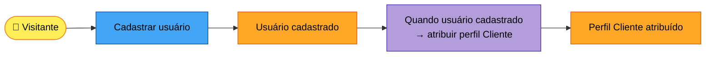
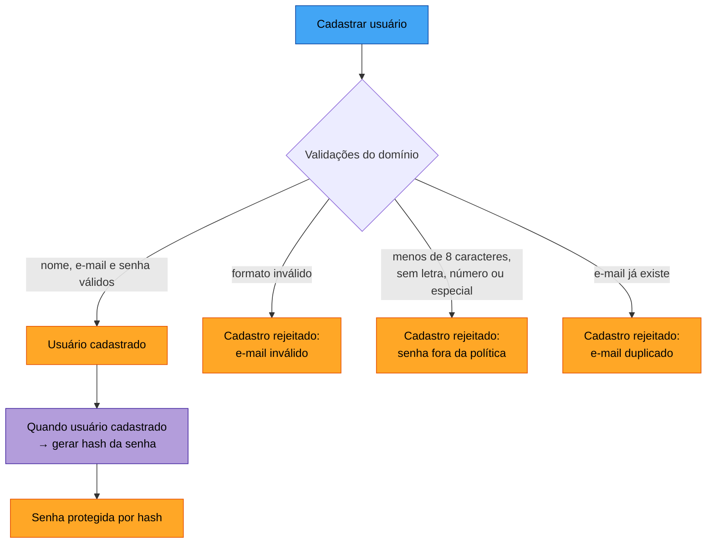
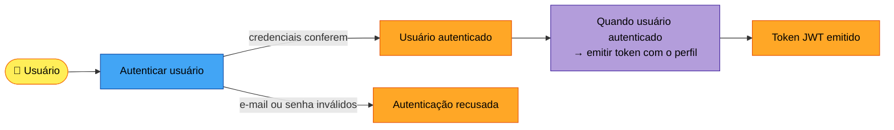
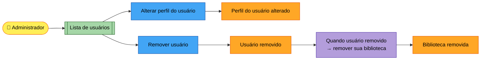
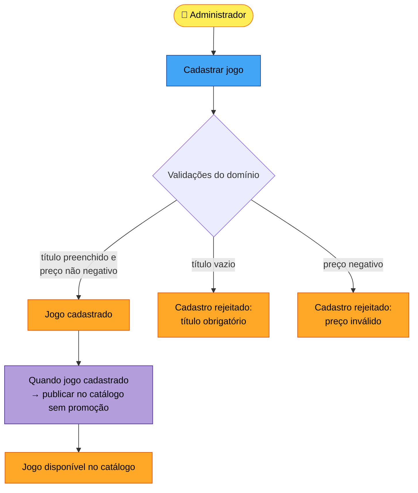
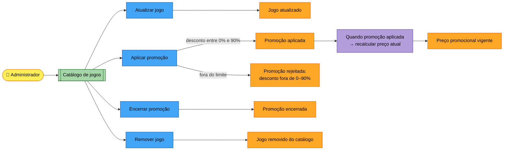
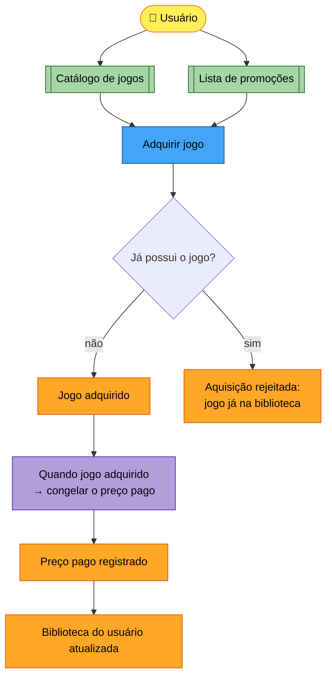
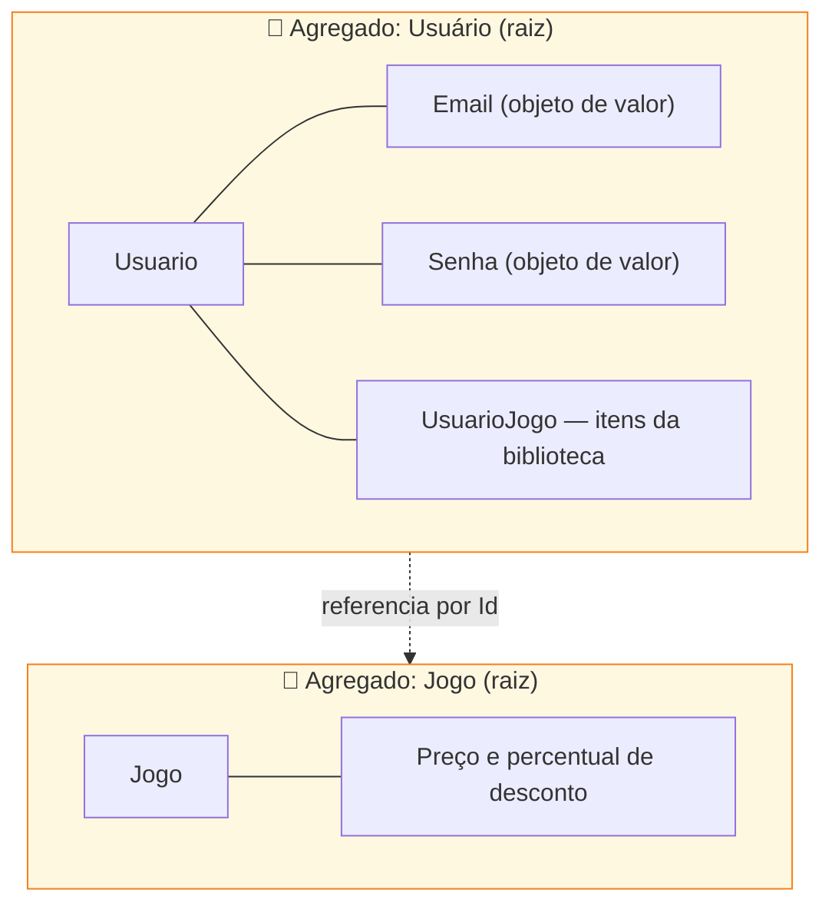
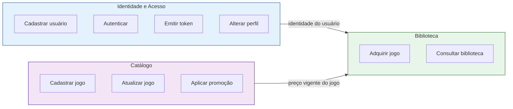

# Event Storming — FIAP Cloud Games (FCG)

Documentação DDD do Tech Challenge — Fase 1.

O Event Storming é a oficina que descobre como o negócio funciona **por meio dos
eventos**, começando pelos acontecimentos e não por telas ou tabelas. Este documento
registra o resultado da modelagem dos dois fluxos exigidos pelo desafio — **criação de
usuários** e **criação de jogos** — mais o fluxo de **aquisição**, que é o coração da
plataforma.

---

## Legenda

Notação da disciplina (Aula 06 — Event Storming):

| Elemento | Cor | O que é | Como se escreve |
|---|---|---|---|
| **Evento de domínio** | 🟧 Laranja | Algo que **já aconteceu** | Passado — "Usuário cadastrado" |
| **Comando** | 🟦 Azul | Ação que **causa** o evento | Imperativo — "Cadastrar usuário" |
| **Ator** | 🟨 Amarelo | Quem dispara o comando | Pela função — "Administrador" |
| **Política** | 🟪 Roxo | Regra que **reage** a um evento e dispara outro comando | "Quando… então…" |
| **Modelo de leitura** | 🟩 Verde | Tela/consulta vista **antes** de um comando | "Catálogo de jogos" |
| **Ponto de atenção** | 🔴 Rosa | Dúvida, risco ou gargalo a investigar | Pergunta aberta |
| **Evento pivotal** | ⬛ Linha vertical | Marca troca de fase — indica **contexto delimitado** | — |
| **Agregado** | ⬜ Agrupamento | Objeto central que reúne comandos e eventos | — |

---

## Domínio e subdomínios

O domínio da FCG é a **venda de jogos digitais e gestão de partidas online**. Dividido
segundo a regra de decisão da Aula 01:

| Subdomínio | Tipo | Por quê |
|---|---|---|
| **Catálogo e Biblioteca de Jogos** | 🔴 Core | É o que diferencia a plataforma — vender jogos e manter a biblioteca do jogador |
| **Identidade e Acesso** | 🟡 Genérico | Todo mundo no mercado tem igual; complexo, mas não diferencia |
| **Cadastro de Usuários** | 🟢 Suporte | Lógica simples, apoia o principal |

> Atenção ao contexto: autenticação é **genérica** para a FCG, mas seria o **core** de
> uma empresa como a Auth0. O tipo depende de quem está olhando.

---

## Fluxo 1 — Criação de usuários

### Linha do tempo

### Caminho ideal e exceções

> As exceções são eventos de domínio como quaisquer outros — no Event Storming elas
> entram na linha do tempo, não são "erros técnicos" escondidos.

### Autenticação (evento pivotal)

**⬛ Evento pivotal: "Usuário autenticado"**

Marca a fronteira entre o contexto de **Identidade e Acesso** e todo o restante da
plataforma. Antes dele o visitante é anônimo; depois, todo comando carrega um perfil
que decide o que ele pode fazer.

### Administração de usuários

---

## Fluxo 2 — Criação de jogos

### Manutenção e promoções

---

## Fluxo 3 — Aquisição de jogo (o core)

**⬛ Evento pivotal: "Jogo adquirido"**

Separa o contexto de **Catálogo** (o jogo como produto à venda) do contexto de
**Biblioteca** (o jogo como item que pertence a alguém). É o momento em que o preço
deixa de ser "de tabela" e passa a ser "o que foi pago".

---

## Pontos de atenção

Levantados durante a modelagem — riscos e decisões conscientes desta fase:

| 🔴 Ponto de atenção | Situação nesta fase |
|---|---|
| Não existe pagamento — a aquisição é imediata | Fora do escopo da Fase 1; o preço é registrado, mas nada é cobrado |
| O administrador inicial nasce com senha padrão | Necessário para quebrar o impasse (só admin cadastra jogo); precisa ser trocada |
| Não há confirmação de e-mail | O cadastro é aceito sem verificar se o e-mail existe de fato |
| Não há refresh token | Expirado o token, é preciso autenticar de novo |
| Remover usuário apaga a biblioteca | Perde-se o histórico de compras — reavaliar quando houver pagamento |
| Remover jogo é bloqueado se alguém já comprou | Protege o histórico da biblioteca |
| Promoção não tem vigência por data | O desconto vale até alguém encerrá-lo manualmente |

---

## Agregados

Agrupando comandos e eventos em torno do objeto que protege a consistência:

**Consistência forçada:** a biblioteca só muda por `Usuario.AdquirirJogo()`. Nenhum
objeto externo adiciona um item diretamente na coleção — pode apenas **solicitar** que
o agregado o faça, e é aí que a regra "não pode comprar duas vezes" é aplicada.

| Bloco | Pergunta-chave | No projeto |
|---|---|---|
| **Entidade** | Quem é? | `Usuario`, `Jogo`, `UsuarioJogo` |
| **Objeto de Valor** | Quanto vale / como é? | `Email`, `Senha` |
| **Agregado** | Qual conjunto se protege? | `Usuario` + biblioteca |

---

## Contextos delimitados

Os eventos pivotais revelaram três fronteiras:

Nesta fase, como o desafio pede um **monolito**, os três contextos convivem no mesmo
processo e no mesmo banco — mas já separados em pastas e agregados, o que permite
extraí-los em serviços independentes nas próximas fases.

**Padrão de integração:** Catálogo é *upstream* da Biblioteca (fornece o preço vigente);
Identidade é *upstream* de ambos (fornece quem está agindo).

---

## Linguagem ubíqua

O dicionário do projeto — os mesmos termos na conversa, na documentação e no código:

| Termo | Significado |
|---|---|
| **Usuário** | Pessoa cadastrada na plataforma; tem um perfil |
| **Perfil** | Nível de acesso: `Cliente` ou `Admin` |
| **Cliente** | Usuário que acessa a plataforma e sua biblioteca |
| **Administrador** | Usuário que cadastra jogos, administra usuários e cria promoções |
| **Jogo** | Item do catálogo, com preço de tabela |
| **Catálogo** | Conjunto de todos os jogos disponíveis |
| **Promoção** | Desconto percentual vigente sobre o preço de tabela |
| **Preço de tabela** | Valor cadastrado do jogo, sem desconto |
| **Preço atual** | Valor cobrado hoje, já com a promoção aplicada |
| **Preço pago** | Valor efetivamente pago na aquisição — não muda depois |
| **Adquirir** | Ato de incluir um jogo na biblioteca do usuário |
| **Biblioteca** | Conjunto de jogos que um usuário adquiriu |

> **Termo ambíguo resolvido:** "preço" significava três coisas diferentes — o cadastrado,
> o promocional e o que o usuário pagou. Separar em **preço de tabela**, **preço atual** e
> **preço pago** eliminou a ambiguidade, e os três nomes aparecem no código.

---

## Rastreabilidade — do evento ao código

Cada evento modelado tem endereço na implementação:

| Evento de domínio | Onde vive |
|---|---|
| Usuário cadastrado | `Usuario.Criar()` |
| Cadastro rejeitado: e-mail inválido | `Email.Criar()` |
| Cadastro rejeitado: senha fora da política | `Senha.Criar()` |
| Cadastro rejeitado: e-mail duplicado | `AuthController.Registrar()` |
| Usuário autenticado / recusado | `Usuario.Autenticar()` |
| Token JWT emitido | `TokenService.GerarToken()` |
| Perfil do usuário alterado | `Usuario.AlterarPerfil()` |
| Jogo cadastrado / rejeitado | `Jogo.Criar()` |
| Jogo atualizado | `Jogo.Atualizar()` |
| Promoção aplicada / rejeitada | `Jogo.AplicarPromocao()` |
| Promoção encerrada | `Jogo.EncerrarPromocao()` |
| Preço promocional vigente | `Jogo.PrecoAtual()` |
| Jogo adquirido | `Usuario.AdquirirJogo()` |
| Aquisição rejeitada: já na biblioteca | `Usuario.JaPossui()` |
| Preço pago registrado | `UsuarioJogo.Criar()` |

---

## Resumo do workshop

Seguindo a ordem da Aula 06:

1. **Brainstorming de eventos** — 20 eventos de domínio levantados, incluindo as rejeições
2. **Linha do tempo** — organizados em caminho ideal + exceções
3. **Pontos de atenção** — 7 riscos registrados
4. **Eventos pivotais** — "Usuário autenticado" e "Jogo adquirido"
5. **Comandos e atores** — 10 comandos, 3 atores (Visitante, Usuário, Administrador)
6. **Políticas** — 6 automações que reagem a eventos
7. **Modelos de leitura** — catálogo, promoções, biblioteca, perfil, lista de usuários
8. **Sistemas externos** — nenhum nesta fase (pagamento entra em fases futuras)
9. **Agregados** — Usuário (com a biblioteca) e Jogo
10. **Contextos delimitados** — Identidade e Acesso, Catálogo e Biblioteca
